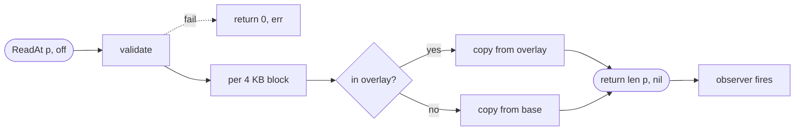
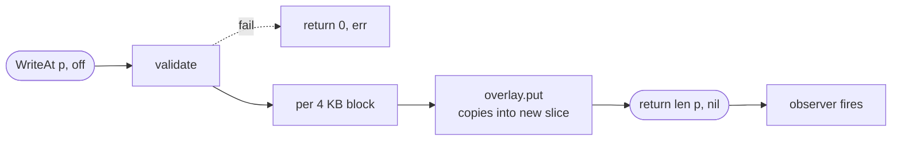

# blockdev

A copy-on-write, in-memory block device backend in Go. Designed for E2B-style microVM snapshot/resume: many sandboxes share one immutable base in RAM, each captures its own writes in an overlay, and `Serialize` emits only the diff.

[](https://github.com/codingminions/blockdev/actions/workflows/ci.yml)
[](https://pkg.go.dev/github.com/codingminions/blockdev)
[](LICENSE)

> **Status: v0.1.0.** API stable. Format locked by golden-bytes test.

---

## How it fits together


Two layers: 
- a **base** (immutable, often shared across many devices) and
- an **overlay** (per-instance, only stores changed blocks). Reads consult the overlay first and fall through to the base. Writes go to the overlay; the base is never mutated.
    - `Serialize` emits only the overlay; `Deserialize` reconstructs from blob + the original base.
    - An optional **observer** receives an `Event` after every public op.

---

## Quickstart

```sh
go get github.com/codingminions/blockdev
```

Go 1.22+ · No external dependencies.

**1. Create a device** on any base whose length is a multiple of `BlockSize` (4096).

```go
base := make([]byte, 16*blockdev.BlockSize)   // 64 KB
bd, _ := blockdev.New(base)
```

**2. Write data.** Captured in the overlay. Base stays untouched.

```go
data := bytes.Repeat([]byte{'A'}, blockdev.BlockSize)
bd.WriteAt(data, blockdev.BlockSize)
```

**3. Snapshot.** Only the changed block ships in the blob.

```go
blob := bd.Serialize()
fmt.Printf("snapshot: %d bytes (vs %d-byte base)\n", len(blob), len(base))
// snapshot: 4104 bytes (vs 16384-byte base)
```

**4. Restore** on the other side from `blob` + the same `base`.

```go
bd2, _ := blockdev.Deserialize(blob, base)
```

Full runnable demos in [`examples/`](examples/).

---

## How to run and test

### Verify everything works

| Check | Command |
|---|---|
| Build | `go build ./...` |
| Test with race detector | `go test -race -count=1 ./...` |
| Vet | `go vet ./...` |
| Format | `gofmt -l .` |

### Benchmarks

| Run | Command |
|---|---|
| Quick | `go test -bench=. -benchmem ./tests/benchmarks/...` |
| Stable (slower) | add `-benchtime=5s -count=10` to the quick command |

### Examples

| Demo | Command |
|---|---|
| Basic write + read | `go run ./examples/basic` |
| Snapshot + resume | `go run ./examples/snapshot-resume` |

CI runs `build` · `vet` · `gofmt` · `test -race` on every PR (Go 1.22 + 1.23 matrix). Benchmarks run separately on every push to `main` and nightly; chart linked under [Benchmarks](#benchmarks).

---

## Read and write flows

### Read



The branch in the middle is the COW core: each block is served from overlay if present, otherwise from base. Nothing else has to change.

### Write



`overlay.put` copies the bytes so the caller can reuse `p` immediately. The base is not touched.

---

## API surface

### Core methods

| Function | What it does |
|---|---|
| `New(initial, opts...) (*BlockDevice, error)` | Construct from a base. `len(initial)` must be a multiple of `BlockSize`. |
| `(*BlockDevice).ReadAt(p, off) (int, error)` | `io.ReaderAt`. Per block: overlay if present, otherwise base. |
| `(*BlockDevice).WriteAt(p, off) (int, error)` | `io.WriterAt`. Captured in overlay; base never mutated. |
| `(*BlockDevice).Serialize() []byte` | Snapshot the overlay. `nil` for a fresh device. |
| `Deserialize(blob, initial, opts...) (*BlockDevice, error)` | Reconstruct from snapshot + base. |

### Options

| Option | Purpose |
|---|---|
| `WithName(string)` | Tag the device so observer events carry an identifier. |
| `WithObserver(func(Event))` | Sync callback fired post-op; panic-recovered so it can't crash the I/O path. |

### Types

| Type | Shape |
|---|---|
| `Event` | `{Op, Device, Offset, Length, Blocks, Duration, Err}` |
| `Op` | `OpRead` · `OpWrite` · `OpSerialize` · `OpDeserialize` (typed `uint8` with `Stringer`) |
| `BlockSize` · `EntrySize` | `4096` · `4104` (constants) |

### Errors (match with `errors.Is`)

| Sentinel | Cause |
|---|---|
| `ErrMisaligned` | Offset or length not a multiple of `BlockSize` |
| `ErrOutOfBounds` | Read or write would extend past device length |
| `ErrBadFormat` | `Deserialize` blob is malformed |

> All offsets and lengths in `ReadAt`/`WriteAt` must be multiples of `BlockSize` (4096).

---

## Major design decisions

One-line rationale here; ADR linked where the full reasoning lives.

| Decision | Choice | Why |
|---|---|---|
| Block size | `4096` bytes | OS page + NBD sector convention |
| Overlay | `map[int64][]byte` + `sync.RWMutex` | O(1) lookup, parallel reads  |
| Base immutability | Caller contract, not enforced | Sharing one base across many sandboxes |
| Constructor | Functional options | Add knobs later without breaking callers |
| Serialization | `[8B BE block#][4096B data]`, sorted | Smallest overhead, deterministic |
| Errors | Sentinel + `fmt.Errorf` wrap | `errors.Is` works without parsing strings  |
| Validation order | Bounds → alignment | Range vs shape bugs map to different sentinels |
| Observer | Sync, post-op, outside locks | Honest latency, panic-safe  |
| `Deserialize` checks | Strict (length + range + dedup + order) | Catches storage corruption |
| Empty `Serialize()` | Returns `nil` | Zero-allocation fresh-device path |
| Dependencies | stdlib only | Clean module |

---

## Current state

**Done in v0.1.0**

- `New`, `ReadAt`, `WriteAt`, `Serialize`, `Deserialize` — functionally complete
- Implements `io.ReaderAt` and `io.WriterAt` (compile-time asserted)
- Functional options: `WithName`, `WithObserver`
- 28 black-box tests in `tests/e2e/`, all pass under `-race`
- 14 benchmarks in `tests/benchmarks/`
- Wire format locked by golden-bytes test
- CI: `build` + `vet` + `gofmt` + `test -race` on Go 1.22 + 1.23
- Nightly benchmark chart on GitHub Pages

**Deliberately out of scope**

- NBD server integration (caller wires this via `io.ReaderAt`/`io.WriterAt`)
- FUSE filesystem
- Sharded mutexes
- Overlay compression / encryption
- `Codec` interface for pluggable formats
- Fuzz tests for `Deserialize`
- Snapshot diff between two serialized blobs
- Baked-in Prometheus metrics — use `WithObserver`

---

## Benchmarks

Latest local numbers (Apple M1 Pro):

| Path | ns/op | allocs/op |
|---|---:|---:|
| `ReadAt` 4 KB from base | 77 | 0 |
| `ReadAt` 4 KB from overlay | 78 | 0 |
| `WriteAt` 4 KB (new block) | 442 | 1 |
| `Serialize` 100 blocks | 52 µs | 12 |
| `Deserialize` 100 blocks | 67 µs | 114 |
| Concurrent parallel reads | 146 | 0 |

**Live chart from `main`** (updated on every push and nightly): <https://codingminions.github.io/blockdev/dev/bench/>

---

## License

[MIT](LICENSE).
