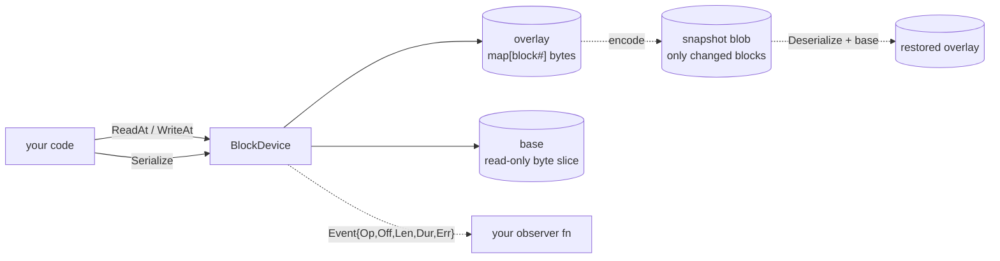

# blockdev

A copy-on-write, in-memory block device backend in Go. Designed for E2B-style microVM snapshot/resume: many sandboxes share one immutable base in RAM, each captures its own writes in an overlay, and `Serialize` emits only the diff.

[](https://github.com/codingminions/blockdev/actions/workflows/ci.yml)
[](https://pkg.go.dev/github.com/codingminions/blockdev)
[](LICENSE)

> **Status: v0.1.0.** API stable. Format locked by golden-bytes test.

---

## How it fits together



Two layers: 
- a **base** (immutable, often shared across many devices) and
- an **overlay** (per-instance, only stores changed blocks). Reads consult the overlay first and fall through to the base. Writes go to the overlay; the base is never mutated.
    - `Serialize` emits only the overlay; `Deserialize` reconstructs from blob + the original base.
    - An optional **observer** receives an `Event` after every public op.

---

## Quickstart

```sh
go get github.com/codingminions/blockdev
```

Go 1.22+ · No external dependencies.

**1. Create a device** on any base whose length is a multiple of `BlockSize` (4096).

```go
base := make([]byte, 16*blockdev.BlockSize)   // 64 KB
bd, _ := blockdev.New(base)
```

**2. Write data.** Captured in the overlay. Base stays untouched.

```go
data := bytes.Repeat([]byte{'A'}, blockdev.BlockSize)
bd.WriteAt(data, blockdev.BlockSize)
```

**3. Snapshot.** Only the changed block ships in the blob.

```go
blob := bd.Serialize()
fmt.Printf("snapshot: %d bytes (vs %d-byte base)\n", len(blob), len(base))
// snapshot: 4104 bytes (vs 16384-byte base)
```

**4. Restore** on the other side from `blob` + the same `base`.

```go
bd2, _ := blockdev.Deserialize(blob, base)
```

Full runnable demos in [`examples/`](examples/).

---

## How to run and test

### Verify everything works

| Check | Command |
|---|---|
| Build | `go build ./...` |
| Test with race detector | `go test -race -count=1 ./...` |
| Vet | `go vet ./...` |
| Format | `gofmt -l .` |

CI runs `build` · `vet` · `gofmt` · `test -race` on every PR (Go 1.22 + 1.23 matrix).

---

## Playground

Click-through demo in your browser — Go compiled to WebAssembly, everything in the tab.

- **Live**: _(coming soon — gh-pages)_
- **Local**:
  ```
  cd playground && GOOS=js GOARCH=wasm go build -o blockdev.wasm . && python3 -m http.server 8000
  ```

What you see: 
- initialize a device, write and read blocks, snapshot the overlay, discard the device, restore from hex. 
- Reloading the tab wipes everything — that *is* the "in-memory" proof. 
- Writes only paint the overlay row (blue); reads served by overlay paint the read row red. 
- COW routing made visible.

Concurrency isn't exercised here (single click at a time) but is covered by `go test -race ./tests/e2e/...`.


---

## Read and write flows

- `ReadAt`: validates, then for each block consults the overlay (if present) or falls through to the base, then copies into the caller's `p`. 
- `WriteAt`: validates, then for each block calls `overlay.put` which copies into a fresh slice; the base is never touched.

---

## API surface

One type (`BlockDevice`), six funcs/methods, three sentinel errors, two options. Stdlib-only.

```go
bd, _ := blockdev.New(base)
bd.ReadAt(p, off)
bd.WriteAt(p, off)
blob := bd.Serialize()
bd2, _ := blockdev.Deserialize(blob, base)

blockdev.WithName(name)
blockdev.WithObserver(fn)
```

Full reference, with per-field semantics, contracts, and error wrapping behavior:

- [API reference](docs/api.md) — methods, options, types, constants, contracts
- [Errors](docs/api.md#errors) — `ErrMisaligned`, `ErrOutOfBounds`, `ErrBadFormat`

All offsets and lengths in `ReadAt`/`WriteAt` must be multiples of `BlockSize` (4096).

---

## Benchmarks

| Run | Command |
|---|---|
| Quick | `go test -bench=. -benchmem ./tests/benchmarks/...` |
| Stable (slower) | add `-benchtime=5s -count=10` to the quick command |

**Live chart from `main`** (updated on every push and nightly): <https://codingminions.github.io/blockdev/dev/bench/>

---

## License

[MIT](LICENSE).
