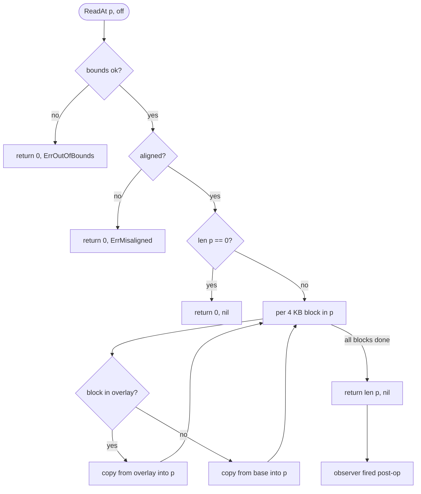
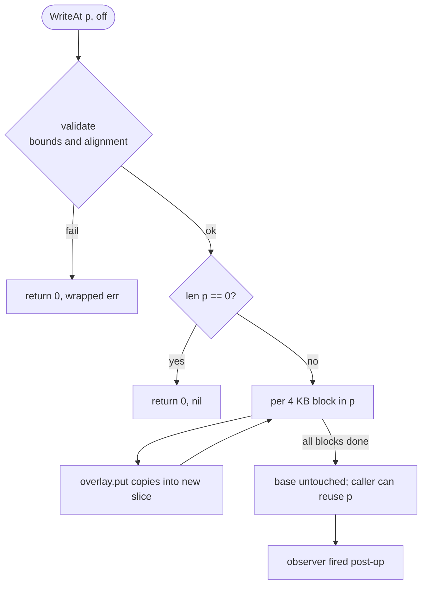

# blockdev

A copy-on-write, in-memory block device backend in Go. Designed for E2B-style microVM snapshot/resume: many sandboxes share one immutable base in RAM, each captures its own writes in an overlay, and `Serialize` emits only the diff.

[](https://github.com/codingminions/blockdev/actions/workflows/ci.yml)
[](https://pkg.go.dev/github.com/codingminions/blockdev)
[](LICENSE)

> **Status: v0.1.0.** API stable. Format locked by golden-bytes test.

## How it fits together

```mermaid
flowchart LR
    Caller[your code] -->|"ReadAt / WriteAt"| BD[BlockDevice]
    Caller -->|"Serialize"| BD

    BD --> Overlay[(overlay<br/>map block→bytes)]
    BD --> Base[(base<br/>read-only []byte)]
    Overlay -.->|encode| Blob[(snapshot blob<br/>only changed blocks)]
    Blob -.->|Deserialize + base| Overlay2[(restored overlay)]

    BD -.->|"Event{Op,Off,Len,Dur,Err}"| Obs[your observer fn]
```

A `BlockDevice` is two layers: a **base** (immutable `[]byte`, often shared across many devices) and an **overlay** (per-instance, only stores blocks that were written). Reads consult the overlay first, fall through to the base. Writes go to the overlay; the base is never mutated. `Serialize` emits only the overlay; `Deserialize` reconstructs from the blob plus the original base. An optional **observer** receives an `Event` after every public op for metrics or logging.

## Quickstart

```sh
go get github.com/codingminions/blockdev
```

Requires Go 1.22+. No external dependencies.

```go
base := make([]byte, 16*blockdev.BlockSize)  // 64 KB shared base

bd, _ := blockdev.New(base)
bd.WriteAt(myBlock, blockdev.BlockSize)      // captured in overlay

blob := bd.Serialize()                        // diff only
bd2, _ := blockdev.Deserialize(blob, base)    // reconstruct elsewhere
```

Two runnable demos in [`examples/`](examples/).

## How to run and test

| What | Command |
|---|---|
| Build | `go build ./...` |
| Unit + e2e tests (race detector on) | `go test -race -count=1 ./...` |
| Just the e2e suite | `go test -race ./tests/e2e/...` |
| Benchmarks | `go test -bench=. -benchmem ./tests/benchmarks/...` |
| Benchmarks, stable numbers | `go test -bench=. -benchmem -benchtime=5s -count=10 ./tests/benchmarks/...` |
| Format check | `gofmt -l .` |
| Vet | `go vet ./...` |
| Run a demo | `go run ./examples/basic` · `go run ./examples/snapshot-resume` |

CI runs every check above on every PR (Go 1.22 + 1.23 matrix). Benchmarks run separately on every push to `main` and nightly; chart linked under [Benchmarks](#benchmarks).

## API surface

| Identifier | Role |
|---|---|
| `New(initial, opts...) (*BlockDevice, error)` | Construct from a base. `len(initial)` must be a multiple of `BlockSize`. |
| `(*BlockDevice).ReadAt(p, off) (int, error)` | `io.ReaderAt`. Per block: overlay if present, otherwise base. |
| `(*BlockDevice).WriteAt(p, off) (int, error)` | `io.WriterAt`. Captured in overlay; base never mutated. |
| `(*BlockDevice).Serialize() []byte` | Snapshot the overlay. `nil` for a fresh device. |
| `Deserialize(blob, initial, opts...) (*BlockDevice, error)` | Reconstruct from snapshot + base. |
| `WithName(string)` | Tag the device for event attribution. |
| `WithObserver(func(Event))` | Sync callback fired post-op, panic-recovered. |
| `Event` | `{Op, Device, Offset, Length, Blocks, Duration, Err}` |
| `Op` | `OpRead`, `OpWrite`, `OpSerialize`, `OpDeserialize` (typed `uint8` with `Stringer`) |
| `BlockSize`, `EntrySize` | `4096`, `4104` |
| `ErrMisaligned`, `ErrOutOfBounds`, `ErrBadFormat` | Sentinel errors (`errors.Is`) |

All offsets and lengths passed to `ReadAt` / `WriteAt` must be multiples of `BlockSize`.

## Major design decisions

Each row links to its ADR with the full rationale.

| Decision | Choice | Why |
|---|---|---|
| Block size | 4096 bytes, fixed | Matches OS page + NBD sector convention; smaller costs RMW, larger inflates per-block storage |
| Overlay structure | `map[int64][]byte` + `sync.RWMutex` | O(1) lookup, only changed blocks stored, reads parallel · [ADR 0001](docs/decisions/0001-overlay-data-structure.md) |
| Base immutability | Documented contract, not enforced | Defensive copy would double peak memory when many sandboxes share one image · [ADR 0004](docs/decisions/0004-base-immutability.md) |
| Constructor | Functional options (`New(base, opts...)`) | Add knobs in future versions without breaking callers · [ADR 0006](docs/decisions/0006-configuration-pattern.md) |
| Serialization format | `[8B BE block#][4096B data]` repeated, sorted ascending | Smallest possible overhead; deterministic; golden-bytes testable · [ADR 0002](docs/decisions/0002-serialization-format.md) |
| Errors | Sentinel + `fmt.Errorf("%w", …)` wrapping | `errors.Is` works without parsing strings · [ADR 0005](docs/decisions/0005-error-handling.md) |
| Validation order | Bounds → alignment → execute | Range bugs surface as `ErrOutOfBounds`, shape bugs as `ErrMisaligned` — distinguishable in logs |
| Observer firing | Synchronous, post-op, outside locks, `defer recover()` | Honest latency, strict ordering, panic in observer can't crash I/O · [ADR 0003](docs/decisions/0003-concurrency-model.md) |
| `Deserialize` validation | Strict (length + range + duplicates + ordering) | Symmetric with what encoder produces; catches storage corruption |
| Empty `Serialize()` | Returns `nil` | Zero allocation for fresh devices |
| Dependencies | stdlib only | Clean module, no supply chain |

## Read and write flows

### Read



### Write — the copy-on-write core



## Current state

Done in v0.1.0:

- `New`, `ReadAt`, `WriteAt`, `Serialize`, `Deserialize` — functionally complete
- Implements `io.ReaderAt` and `io.WriterAt` (compile-time asserted)
- Functional options: `WithName`, `WithObserver`
- 28 black-box tests in `tests/e2e/`, all pass under `-race`
- 14 benchmarks in `tests/benchmarks/`
- 4 godoc-runnable examples (`example_test.go`)
- 6 ADRs documenting every non-obvious choice
- Wire format locked by golden-bytes test
- CI: `build` + `vet` + `gofmt` + `test -race` on Go 1.22 + 1.23
- Nightly benchmark chart on GitHub Pages

Deliberately out of scope:

- NBD server integration (caller wires this via `io.ReaderAt`/`io.WriterAt`)
- FUSE filesystem
- Sharded mutexes
- Overlay compression / encryption
- `Codec` interface for pluggable formats
- Fuzz tests for `Deserialize`
- Snapshot diff between two serialized blobs
- Baked-in Prometheus metrics — use `WithObserver`

## Benchmarks

```sh
go test -bench=. -benchmem ./tests/benchmarks/...
```

Latest local numbers (Apple M1 Pro):

| Path | ns/op | allocs/op |
|---|---:|---:|
| `ReadAt` 4 KB from base | 77 | 0 |
| `ReadAt` 4 KB from overlay | 78 | 0 |
| `WriteAt` 4 KB (new block) | 442 | 1 |
| `Serialize` 100 blocks | 52 µs | 12 |
| `Deserialize` 100 blocks | 67 µs | 114 |
| Concurrent parallel reads | 146 | 0 |

**Live chart from `main`** (updated on every push and nightly): <https://codingminions.github.io/blockdev/dev/bench/>
## License

[MIT](LICENSE).
