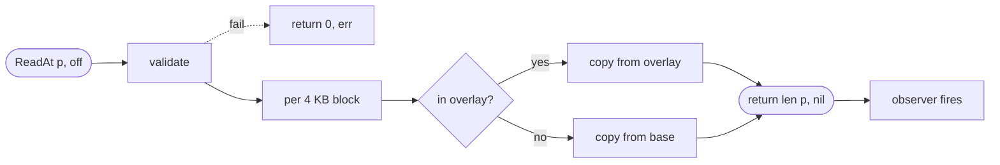
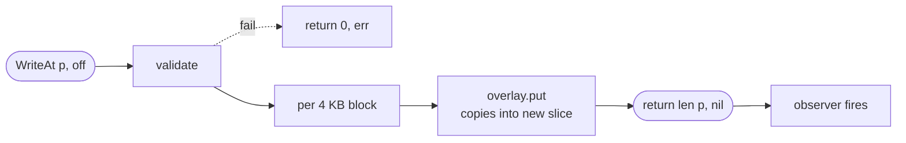

# API reference

The full public surface of `package blockdev`. Stdlib-only, Go 1.22+.

```go
import "github.com/codingminions/blockdev"
```

The whole API: **one type, six funcs/methods, three errors, two options, three types, two constants.**

---

## Read and write flows

### Read



The branch in the middle is the COW core: each block is served from overlay if present, otherwise from base. Nothing else has to change.

### Write



`overlay.put` copies the bytes so the caller can reuse `p` immediately. The base is not touched.

---

## Core methods

| Function | What it does |
|---|---|
| `New(initial []byte, opts ...Option) (*BlockDevice, error)` | Construct from a base. `len(initial)` must be a multiple of `BlockSize`. Returns wrapped `ErrMisaligned` otherwise. Base is **retained by reference, not copied** — see [Contracts](#contracts). |
| `(*BlockDevice).ReadAt(p []byte, off int64) (int, error)` | Implements `io.ReaderAt`. Per block: overlay if present, otherwise base. Returns `(0, wrapped err)` on validation failure; never partial. |
| `(*BlockDevice).WriteAt(p []byte, off int64) (int, error)` | Implements `io.WriterAt`. Each block goes to the overlay (with a fresh allocation + copy). Base is never mutated. Caller may reuse `p` immediately. |
| `(*BlockDevice).Serialize() []byte` | Snapshot the overlay as sorted `[8B BE block#][4096B data]` entries. Returns `nil` for a fresh device (zero allocation). |
| `Deserialize(serialized, initial []byte, opts ...Option) (*BlockDevice, error)` | Reconstruct from a Serialize blob + the original base. Strict validation; rejects malformed, out-of-range, duplicate, or unsorted entries. |

`io.ReaderAt`/`io.WriterAt` compile-time assertions live in `blockdev.go`.

---

## Options

`New` and `Deserialize` accept variadic options. v0.1.0 ships two.

| Option | Purpose |
|---|---|
| `WithName(string) Option` | Tag the device so observer events can attribute them to a source (e.g., one device per agent). |
| `WithObserver(fn func(Event)) Option` | Synchronous callback fired post-op, outside any lock, wrapped in `defer recover()` so a panic in user code can't crash the I/O path. |

---

## Types

### `Event`

```go
type Event struct {
    Op       Op            // operation that produced this event
    Device   string        // value from WithName, or "" if unset
    Offset   int64         // 0 for Serialize/Deserialize
    Length   int           // bytes touched
    Blocks   int           // block entries affected
    Duration time.Duration // post-op
    Err      error         // nil on success
}
```

`Length` and `Blocks` per op:

| `Op` | `Length` | `Blocks` |
|---|---|---|
| `OpRead` / `OpWrite` | `len(p)` | `len(p) / BlockSize` |
| `OpSerialize` | size of returned blob | number of changed blocks emitted |
| `OpDeserialize` | size of input blob | number of blocks loaded |

### `Op`

```go
type Op uint8
const (
    OpRead Op = iota + 1
    OpWrite
    OpSerialize
    OpDeserialize
)
func (Op) String() string  // "read", "write", "serialize", "deserialize"
```

### Constants

| Name | Value | Meaning |
|---|---:|---|
| `BlockSize` | `4096` | Alignment unit for offsets and lengths |
| `EntrySize` | `4104` | On-wire size of one serialized changed block (8 byte block# + `BlockSize` data) |

---

## Errors

Three sentinel errors. Methods wrap them with `fmt.Errorf("…: %w", err)` so the chain includes operation-specific context (offset, length, device size) but `errors.Is` still matches the bare sentinel.

| Sentinel | Cause |
|---|---|
| `ErrMisaligned` | Offset or length isn't a multiple of `BlockSize`, or `len(initial)` isn't a multiple of `BlockSize` |
| `ErrOutOfBounds` | Read/write would extend past device length, or offset is negative |
| `ErrBadFormat` | `Deserialize` input is malformed: bad length, out-of-range block#, duplicate, or unsorted entry |

Match in caller code:

```go
if errors.Is(err, blockdev.ErrMisaligned)  { /* … */ }
if errors.Is(err, blockdev.ErrOutOfBounds) { /* … */ }
if errors.Is(err, blockdev.ErrBadFormat)   { /* … */ }
```

The wrapped error's `Error()` string carries operation context, e.g.:

```
blockdev.ReadAt off=4097 len=4096: blockdev: offset or length not block-aligned
```

---

## Contracts

| What | Rule | Why |
|---|---|---|
| `initial` immutability | Caller must not mutate `initial` after passing to `New` or `Deserialize` | Defensive copy would double peak memory; many sandboxes share one base |
| Offset/length alignment | Multiples of `BlockSize` | Spec requirement; tracking byte-by-byte is wasteful |
| `WriteAt` caller buffer | May be reused immediately after the call returns | Overlay copies into a fresh slice internally |
| Concurrency | All public methods safe for concurrent use | `sync.RWMutex` around the overlay; observer fires outside locks |
| Observer panics | Recovered and silently swallowed | A buggy user callback must not crash NBD I/O |
| `Serialize` determinism | Same overlay state → identical bytes regardless of write order | Sort by block number internally |
| Validation order | Bounds checked before alignment | Range bugs surface as `ErrOutOfBounds`, shape bugs as `ErrMisaligned` |

---
